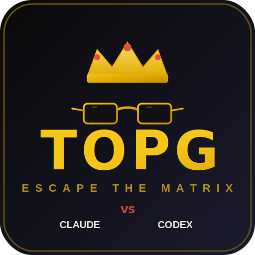

<p align="center">
  
</p>

<h1 align="center">TOPG</h1>
<h3 align="center">The Top G of AI Agent Frameworks</h3>

Listen. Most developers out there are using ONE AI model like broke people driving a single Honda Civic. They ask Claude a question. They get ONE answer. They accept it like sheep. They never question it. They never challenge it. They live in the matrix.

**TOPG escapes the matrix.**

TOPG throws Claude and Codex into the arena. Two elite AI agents. Head to head. No mercy. They debate, they argue, they tear each other's solutions apart, and what comes out the other side is a battle-tested answer that ACTUALLY WORKS. Because the best ideas don't come from comfort. They come from WAR.

And when you need a second opinion mid-task? TOPG opens a collaboration session with the other model. Code review, design consultation, validation — on demand, session-based, under YOUR control.

> "If you're making architectural decisions with only one AI, you're mentally broke."

---

## What Is This

TOPG is a TypeScript CLI with two tools:

### `topg debate` — Intellectual Combat

You give it a problem. Both agents fight over the solution. They critique each other's code. They defend their positions. They either converge on the superior answer, or they escalate to you with a structured disagreement report so YOU can be the judge.

```
You: topg debate "How should I structure my auth middleware?"

Claude: *proposes solution with trade-offs*
Codex:  *tears it apart, offers counter-proposal*
Claude: *defends position, concedes valid points*
Codex:  *accepts improvements, pushes back on weakness*

→ CONSENSUS REACHED → Battle-tested solution delivered
```

### `topg collaborate` — On-Demand Cross-Model Collaboration

Open a session with the other AI model mid-task. Exchange messages over time. Close when done. You control the flow.

```
You: topg collaborate start --with codex "Review my implementation for bugs"
Codex: "Found 3 issues: ..."
You: topg collaborate send "Fixed issues 1 and 3. Re-review?" --last
Codex: "Clean. Issue 2 is still present at line 42."
You: topg collaborate end --last
```

---

## Why You Need This

Because mediocrity is a CHOICE.

- **One model gives you one perspective.** That's a poor person's mindset.
- **Two models debating gives you the TRUTH.** Every weakness gets exposed. Every edge case gets caught. Every lazy shortcut gets called out.
- **Two models collaborating mid-task** means you catch bugs before they ship, validate designs before you commit, and get a second opinion without leaving your terminal.
- **Your code gets pressure-tested** before it ever hits production. While other developers are shipping bugs, you're shipping excellence.

Use TOPG for decisions that actually matter:
- Architectural choices (debate)
- Security-sensitive code review (collaborate or debate)
- API design (debate)
- Mid-task code review (collaborate)
- Complex debugging when you're stuck (debate)
- Design consultation before committing to an approach (collaborate)
- Any decision where being wrong costs you

---

## Installation

Winners move fast.

```bash
npm install
npm run build
```

Set your keys like a professional:
```bash
export ANTHROPIC_API_KEY="your-key"
export OPENAI_API_KEY="your-key"
```

Already paying for Claude Pro/Max or a Codex subscription? **You're already covered.** TOPG works with your existing subscriptions. You're literally leaving money on the table if you're NOT using this.

Think about it. You're paying for TWO of the most powerful AI models on the planet and you're using them ONE AT A TIME like a guy with two Bugattis who only drives on Sundays. That's not hustle. That's waste. That's BROKE behavior with a rich man's credit card.

TOPG makes your subscriptions WORK FOR YOU. While you sleep, while you think, while you sip your coffee, two AI gladiators are in the arena destroying each other's weak arguments so YOU get the strongest answer. That's leverage. That's what separates the Top G from the NPCs.

> "What color is your Bugatti?" Irrelevant. What matters is: are your AI models fighting for you, or are they sitting idle like expensive furniture?

### Claude Code Skills

Tell Claude Code:

```
Install the topg-debate skill from https://github.com/eishan05/topgstack
Install the topg-collaborate skill from https://github.com/eishan05/topgstack
```

Now `/debate` and `/collaborate` work in any session. Both models fight or collaborate without you leaving the terminal.

---

## Usage

### Debate: Ask and Receive

```bash
topg debate "Design a rate limiter that handles distributed systems"
```

Both agents fight. You get the winner's answer. Simple.

### Debate: Resume a Deadlock

```bash
topg debate --resume <session-id> "Focus on the caching layer, the DB approach is settled"
```

Come back to a deadlocked debate with fresh guidance. YOU are the top G. You break the tie.

### Collaborate: Start a Session

```bash
topg collaborate start --with codex "Review my auth implementation for security issues" --output json --yolo --cwd "$(pwd)"
```

### Collaborate: Send Follow-Ups

```bash
topg collaborate send "I fixed the token validation. Re-review?" --last --output json
```

Or with an explicit session ID:
```bash
topg collaborate send "Re-review?" --session abc123 --output json
```

### Collaborate: End the Session

```bash
topg collaborate end --last
```

### Collaborate: List Sessions

```bash
topg collaborate list --active --output json
```

---

## Options

### Debate Options

| Flag | What It Does |
|------|-------------|
| `--start-with <claude\|codex>` | Pick who throws the first punch |
| `--guardrail <N>` | Rounds before escalation (default: 5) |
| `--timeout <seconds>` | Per-turn time limit, no stalling |
| `--yolo` | Skip all permission checks. Full send. |
| `--cwd <path>` | Working directory for the agents |
| `--output <text\|json>` | Output format (default: text) |
| `--resume <sessionId>` | Resume a paused debate with guidance |
| `--codex-sandbox <mode>` | Codex sandbox mode |
| `--codex-web-search <mode>` | Codex web search mode |
| `--codex-reasoning <effort>` | Codex reasoning effort |

### Collaborate Options (start)

| Flag | What It Does |
|------|-------------|
| `--with <claude\|codex>` | Which model to collaborate with (required) |
| `--cwd <path>` | Working directory |
| `--output <text\|json>` | Output format (default: json) |
| `--timeout <seconds>` | Per-turn timeout |
| `--yolo` | Skip all permission checks |
| `--codex-sandbox <mode>` | Codex sandbox mode (default: read-only) |
| `--codex-web-search <mode>` | Codex web search mode |
| `--codex-reasoning <effort>` | Codex reasoning effort |

### Collaborate Options (send/end)

| Flag | What It Does |
|------|-------------|
| `--session <id>` | Target a specific session |
| `--last` | Use the most recent active session |
| `--output <text\|json>` | Output format (default: json) |

Note: `--session` and `--last` are mutually exclusive. You must provide one.

### The `--yolo` Flag

```bash
topg debate --yolo "Refactor the entire payment system"
```

This is how real G's outside the matrix operate. `--yolo` skips ALL permission checks for both agents. Claude gets `--dangerously-skip-permissions`, Codex gets full sandbox access. No confirmation dialogs. No "are you sure?" popups. No waiting for approval from your corporate overlord to run a command on YOUR computer.

If you need to raise your hand and ask permission to execute code on a machine you own, you are living in the matrix. You are a brokie in the system. You are an NPC.

Real builders ship. `--yolo` lets your agents ship.

---

## How The Debate Works

```
         YOU
          │
          ▼
    ┌───────────┐
    │   TOPG    │
    │ Orchestr. │
    └─────┬─────┘
          │
    ┌─────┴─────┐
    ▼           ▼
 ┌───────┐ ┌───────┐
 │CLAUDE │ │ CODEX │
 │  Agent│ │ Agent │
 └───┬───┘ └───┬───┘
     │         │
     └────┬────┘
          │
   Convergence?
    /          \
  YES           NO
   │             │
   ▼             ▼
CONSENSUS    ESCALATION
 (ship it)   (you decide)
```

1. **Turn 1:** Initiator proposes a solution
2. **Turn 2+:** Reviewer critiques with structured claims
3. **Rebuttals:** Point-by-point responses, no hand-waving
4. **Convergence Detection:** Agreement phrases, structured tags, or diff stability
5. **Resolution:** Either consensus or structured disagreement report

The system tracks individual claims using `[claim-N]` sections so nothing gets lost in the noise. Every point must be addressed. No dodging.

---

## Session Management

Every debate and collaboration session is saved. Because winners keep records.

```bash
topg session list                                     # List all sessions
topg session delete <id>                              # Delete a session
topg session clear --completed                        # Clear finished debates
topg session clear --closed                           # Clear closed collaborations
topg session clear --completed --older-than 7d        # Clean up old ones
topg session clear --all --force                      # Nuclear option
```

---

## The Mentality

Most people use AI like consumers. They ask a question, they get an answer, they go home. They never think "what if this answer is wrong?" They never stress-test. They never challenge.

TOPG is for builders who understand that **the best solutions survive criticism**. If your architecture can't withstand scrutiny from a second AI model, it sure as hell won't survive production.

Stop being a one-model developer. **Escape the matrix.**

```bash
topg debate "your hardest problem here"
topg collaborate start --with codex "review what I just built"
```

---

## Contribute

Want to make TOPG better? See [CONTRIBUTING.md](CONTRIBUTING.md).

For the philosophy, read [ETHOS.md](ETHOS.md). For the technical deep dive, see [ARCHITECTURE.md](ARCHITECTURE.md).

---

## License

Do what you want with it. Winners don't ask for permission.
